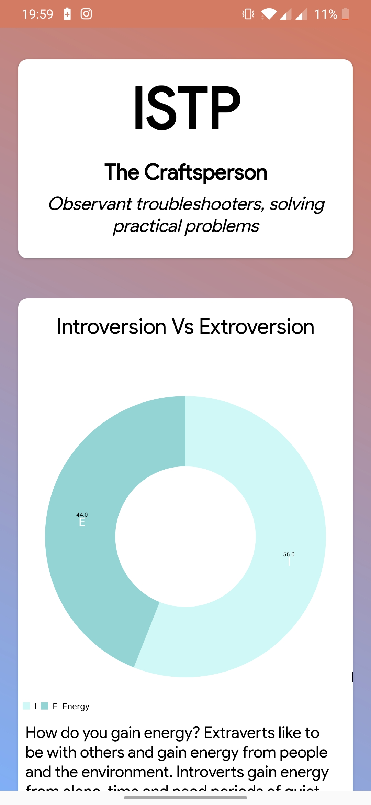
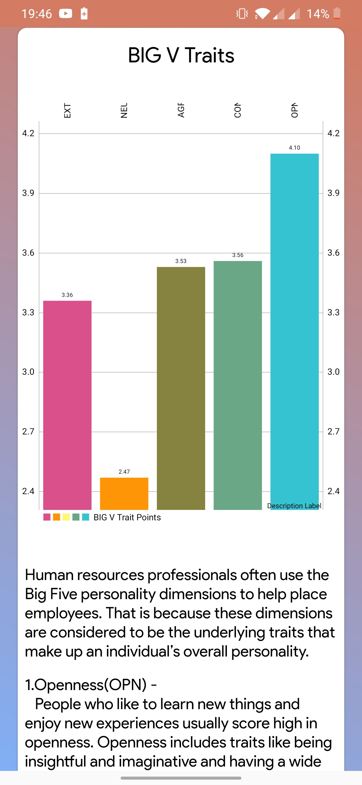

# TweetPersonality

This Project Helps you detect the personality of an person through the use of the person's Tweets and uses MBTI and Big Five Datasets for Accurate Personality Detections.
It Gives Beautiful Pie Charts and Bar Charts for Traitwise Analysis of the personality
This Uses Chaquopy Python Library and Uses Tensorflow libraries 

                                                     Home Screen
                                                                        
                                                                        
                                                                        
                                                                        

                                                     MBTI PieCharts

                                                    Big Five Bar Chart

